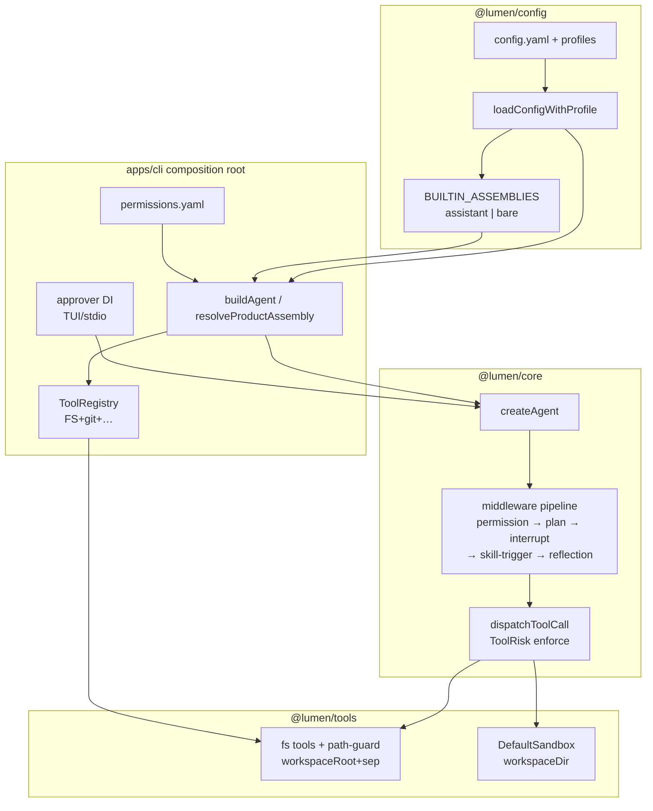
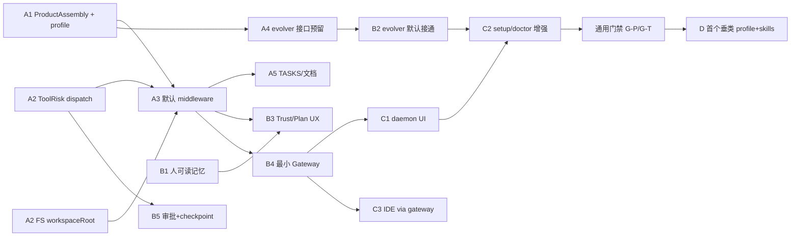

# Lumen 优化方案设计（可执行落地版）

> **定位**：由技术负责人亲自落地的分阶段实施方案，不是空泛建议。  
> **战略**：先建成**通用 Agent 底座**，通用性完成后再孵化多个**垂类助手**（阶段 D / Post-generality）。  
> **配套**：设计 Canvas：`lumen-optimization-design.canvas.tsx` · 路线图：`lumen-iteration-roadmap.canvas.tsx` · 战略：`lumen-generality-to-vertical.canvas.tsx`  
> **正文路径**：`lumen/docs/OPTIMIZATION-PLAN.md`  
> **约束**：遵守 P19+（middleware / Zod state / `createAgent` / ToolRisk / tier isolation / 禁止 AgentConfig boolean 汤）；**本文件只写设计，不实现业务代码**。  
> **日期**：2026-07-29（战略定位修订同日）

---

## 0. 战略定位：通用底座 → 垂类孵化

### 0.1 一句话

**Lumen 要先做成一个「什么场景都能上手」的通用 Agent；通用性真正完成之后，再从这个底座孵化出多个垂类助手（编程、研究、客服、个人助理等）。**

用人话类比：先造好一台**通用操作系统 + 应用商店机制**，再允许别人用配置和插件装出「外卖 App / 银行 App」——**不要**为每个 App 复制一整套操作系统。

### 0.2 两段式时间线（资源纪律）

| 大段 | 对应阶段 | 做什么 | 明确不做什么 |
|---|---|---|---|
| **通用性建设** | **A → B → C** | 默认像助手、安全真强制、会学习、能常驻、好安装好找到 | **不为单个行业写死业务逻辑**；不抢近 2 周 / 一季度人力去做垂直功能 |
| **垂类孵化** | **D / Post-generality** | 用 profile + skills + ProductAssembly + 配置组合出垂类产品 | **禁止**为每个垂类 fork `Agent` 类 / 复制 core；禁止把垂类特判堆进 `AgentConfig` boolean 汤 |

**纪律**：阶段 A/B/C 的排期、验收、Day1–Day5 **全部只服务「通用性完成」**。垂类相关需求可以记入 backlog，但**不得**与近两周安全默认真接、或一季度触达入口抢同一批人天。

### 0.3 为什么必须先通用

1. **垂类是组合，不是分叉**：P19 要求「扩展 loop = middleware」「入口 = `createAgent`」「产品壳 = profile / assembly」。垂类若等于「再写一个 Agent 子类」，会立刻违反架构，长期不可维护。
2. **通用没完成就做垂类 = 假产品**：今天仍是「厚内核 + 薄产品壳、高级能力 opt-in」。在裸跑还不像助手时做「医疗助手 / 法务助手」，只会复制一套半成品。
3. **扩展点可以早留、功能不能早做**：阶段 A 的 `assistant` / `bare` 装配与 `product` 切片，要为「以后加 `coding` / `research` profile」留**同构扩展位**（多一个 assembly 名 + skills 包），但**不提前实现**垂直领域知识、行业合规流水线、垂类专属 UI。

### 0.4 通用性完成的判定（可测门禁 → 才允许进 D）

须**同时**满足产品与技术门禁（细则见 §0.5）；任一未过，仍算通用性未完成，**不开垂类资源闸**。

### 0.5 通用完成标准（产品 + 技术）

#### 产品侧（非技术同学可点验收）

| ID | 标准 | 怎么测 |
|---|---|---|
| G-P1 | 开箱像通用助手 | 新机 `lumen init` → 裸 `lumen chat` / `lumen run`，无需背 `--plan` / `--permissions` / `--enable-skill-trigger` |
| G-P2 | 计划与许可默认可见 | 复杂任务出现「计划 → 批准 → 执行」；危险操作默认询问 |
| G-P3 | 会学习可感知 | 相似任务跑通后，技能列表或 MEMORY/USER 有可感知变化（阶段 B 接通后） |
| G-P4 | 危险出不了圈 | 试图写工作区外路径失败；无 YOLO 默认真机毁数据 |
| G-P5 | 找得到、装得起 | 至少 1 个本机常驻入口可用；`setup` / `doctor` 能发现并提示装配/密钥/工作区问题 |
| G-P6 | 能一键退回裸核 | `--profile bare` / `LUMEN_PRODUCT=off` 行为与「库零件模式」一致（CI/老脚本） |

#### 技术侧（与 P19+ 对齐）

| ID | 标准 | 怎么测 |
|---|---|---|
| G-T1 | 默认走 ProductAssembly，而非 boolean 汤 | `assistant` assembly 声明 middleware 名列表；`AgentConfig` **无** `enablePlan` 一类字段 |
| G-T2 | ToolRisk 在 `dispatchToolCall` enforce | 单测三档；dangerous 无 approver 拒绝 |
| G-T3 | FS/shell 同源 `workspaceRoot+sep` | prefix bypass 用例绿 |
| G-T4 | 学习闭环经 middleware/DI 默认接通 | evolver/trajectory **不**停在「库有、composition 未挂」 |
| G-T5 | HTTP/Gateway 不进 `@lumen/core` | tier 边界；常驻只在 apps 装配 |
| G-T6 | 通用 profile 可扩展、垂类不改 core | 新增垂类 = 新 profile/assembly + skills 包 + 可选 middleware；**零** core fork |

### 0.6 通用底座必须 vs 垂类才做

| 属于**通用底座必须**（A/B/C） | 属于**垂类才做**（D） |
|---|---|
| 计划 / 许可 / 打断 / 技能触发 / 反思 默认装配 | 行业话术包、领域 SOP、合规审查清单 |
| ToolRisk + workspace 边界 + 审批 UX | 垂类专属审批规则（可在 D 用 permissions/skills 叠加） |
| 人可读记忆、技能自进化机制本身 | 「只学法务文书」「只记病历模板」等垂直记忆策略 |
| 最小 Gateway、本机入口、setup/doctor | IM 渠道深度运营、垂类 Companion 皮肤 |
| 通用工具（FS/shell/git…）与沙箱 | 垂类专用外部系统连接器（CRM/HIS…）以 **skills/MCP/配置** 接入，不进 core |
| `assistant` + `bare` 及「再加一个 assembly」的扩展位 | 具体 `coding` / `research` / `cs` 等垂类装配内容与技能包 |

### 0.7 垂类孵化机制（阶段 D 形状，现在只定规矩）

**允许的组合（推荐唯一路径）：**

```
垂类产品 = 同一 createAgent
         + profile（配置切片）
         + ProductAssembly（middleware 名列表 + DI）
         + skills 目录 / 包（领域知识与流程）
         + permissions / 工具子集（可选收窄）
```

**禁止：**

- 为每个垂类 `class XxxAgent extends Agent`
- 复制 `packages/core` 或整仓 fork
- 在 `AgentConfig` 上堆 `enableMedicalMode` / `enableLegalMode`
- 把垂类 HTTP/业务 API 塞进 `@lumen/core`

**阶段 A–C 只需保证**：装配表是「名 → middleware 列表」的可扩展字典；skills 路径可按 profile 切换；**不实现**第一个垂类的业务内容。

### 0.8 对现有 A/B/C 的影响（结论：阶段顺序不砍，语义对齐）

| 阶段 | 调整结论 |
|---|---|
| **A** | **不改交付清单**；语义升格为「通用助手默认壳 + 安全硬闸」。装配扩展点留下，**不做**垂类 assembly 内容。 |
| **B** | **不改交付清单**；语义为「通用自进化与最小常驻」——学习/记忆/Gateway 都是底座能力，不是某个行业功能。 |
| **C** | **不改交付清单**；语义为「通用产品可被找到、可被安装」。第一入口是通用 daemon UI，**不是**垂类 App。 |
| **D** | **新增、排在 C 门禁之后**：首个垂类用配置+skills 孵化；验收「零 core 改动或仅有可复用的通用扩展」。 |

**通常节奏：C 的通用完成门禁通过 → 才开 D。** 近两周与一季度资源 **100% 留给 A/B/C**。

---

## 1. 一页纸总览

### 1.1 目标

把 Lumen 从「厚内核 + 薄产品壳、高级能力默认 opt-in」变成**可被验收的通用 Agent 底座**（再进入垂类孵化）：

| 北极星 | 人话验收 |
|---|---|
| N1 开箱像助手 | 裸 `lumen chat` / `lumen run` 无需背一串 flag |
| N2 计划可见 | 默认能看到「计划 → 批准 → 执行」 |
| N3 会学习 | 用完后技能/记忆有可感知变化 |
| N4 危险可控 | 危险操作默认问；工作区出不去 |
| N5 随时找得到 | 至少 1 个本机常驻入口 |
| N6 可孵化垂类 | 通用门禁通过后，新垂类 = profile/skills/assembly，不 fork 核心 |

### 1.2 设计原则（不可破）

1. **扩展 Agent loop = middleware**；禁止在 `AgentConfig` 上堆 `enablePlan` / `enableSkill` 等 boolean 汤。
2. **产品默认用 profile + ProductAssembly 声明**（middleware 名称列表 + DI 协作件），关闭阀用 CLI/env **opt-out**。
3. **ToolRisk 在 `dispatchToolCall` 强制 enforce**（最后防线）；Permission/Interrupt 是 UX 层，不能替代核心 enforce。
4. **FS 与 shell 同源钳制**：`workspaceRoot + path.sep` 前缀检查；DefaultSandbox 已有路径逻辑，FS 工具对齐。
5. **HTTP / Gateway 永不进 `@lumen/core`**；常驻进程是 Tier-3 composition root，复用 `buildAgent` / `createAgent`。
6. **TASKS 标签拆成「库完成 / 体验未完成」**，避免全绿假象。
7. **先通用、后垂类**：A/B/C 只建底座；垂类 = 配置 + skills + middleware 组合（阶段 D），禁止复制 Agent。

### 1.3 四阶段摘要（A/B/C = 通用；D = 垂类）

| 阶段 | 窗口 | 一句话 | 核心交付 | 战略角色 |
|---|---|---|---|---|
| **A** | 近 2 周 | 开箱像助手 + 安全强制 | assistant 默认 profile、ToolRisk+workspaceRoot、Plan/Permission/Skill 默认挂 | 通用壳落地 |
| **B** | 1–2 月 | 自进化可感知 + 最小常驻 | MEMORY/USER、evolver 接通、Trust/Plan UX、最小 Gateway、审批+checkpoint | 通用会学习 + 常驻 |
| **C** | 一季度 | 触达与安装体验 | 第一非终端入口、setup/doctor、ACP/IDE 单点 | 通用可触达 |
| **D** | Post-generality（C 门禁后） | 垂类孵化 | 首个垂类 profile/skills/assembly；机制文档与样板 | **不**与 A/B/C 抢资源 |

**Skill evolver/trajectory**：阶段 A **只做接口预留 + 导出**；默认接通放到阶段 B（见 §2.A.4），避免 2 周内同时改安全核心与学习闭环导致回滚面过大。

**垂类**：阶段 A–C **只留扩展点**（多 assembly 名、按 profile 选 skills 根）；**不写**垂直业务。详见 §0 与 §4.5。

---

## 2. 阶段 A：近 2 周（开箱像助手 + 安全强制）

### A.1 assistant 默认 product profile + `loadConfigWithProfile`

#### 1. 目标与用户故事

- **作为**第一次安装 Lumen 的用户，**我希望**直接运行 `lumen chat` 就得到「会规划、会问许可、会触发技能」的助手，而不是零件演示。
- **作为**老用户 / CI，**我希望**能一键退回「裸核」行为（`--profile bare` 或 `LUMEN_PRODUCT=off`）。

#### 2. 现状与缺口（证据）

| 现状 | 证据路径 |
|---|---|
| Profile 库已完成：`loadConfigWithProfile` / `profiles` / `defaultProfile` | `packages/config/src/profile.ts`、`schema.ts` |
| CLI 装配仍走 `loadConfig`，**不用** profile API | `apps/cli/src/composition.ts` → `loadCliConfig` → `loadConfig` |
| 无内置 `assistant` 产品 profile；默认 profile 名是字面量 `default` | `DEFAULT_PROFILE = 'default'`（`profile.ts`） |
| Plan / Permission / SkillTrigger 全是 **opt-in flag** | `composition.ts` L367–428；`apps/cli/src/index.ts` `--plan` / `--enable-skill-trigger` / `--permissions` |

#### 3. 设计方案

**配置模型扩展（不做 boolean 汤）：**

在 `LumenConfigSchema` 增加可选 `product` 切片（strict）：

```yaml
# ~/.lumen/config.yaml（用户可覆盖）
defaultProfile: assistant   # 新产品默认；老文件无此项时由内置默认补齐

product:
  assembly: assistant       # 指向内置装配名；或自定义名
  # 关闭阀（显式 opt-out，不是 enableXxx 汤）
  # 也可在 profiles.bare 里把 assembly 设为 bare
```

内置装配表（代码常量，不进 YAML boolean 汤）：

| assembly 名 | middleware 顺序（注册序） | 其它 |
|---|---|---|
| `assistant` | permission → autoMode? → plan(auto) → interrupt(按 risk 推导) → skill-trigger → reflection(inline+runEnd) | permissions 默认 `~/.lumen/permissions.yaml`；无文件则写 starter |
| `bare` | `[]` | 等价今日裸跑，兼容旧用户 / CI |

**CLI 接入：**

- `loadCliConfig` 改为 `loadConfigWithProfile`；返回值带 `profile`。
- `buildAgent` 根据 `config.product?.assembly ?? resolveBuiltinAssembly(profile)` 调用 `resolveProductAssembly(...)` 得到 middleware 列表，再 `createAgent({..., middleware})`。
- 关闭阀优先级（高→低）：`--profile bare` > `LUMEN_PRODUCT=off` > `product.assembly: bare` > 默认 `assistant`。
- 保留现有 `--plan` / `--permissions` / `--enable-skill-trigger` 作为**覆盖/关闭**，语义改为：
  - 未传：跟随 assembly
  - `--no-plan` / `--profile bare`：卸下对应 middleware
  - 显式 `--plan act`：覆盖 plan mode

**API 变 / 不变：**

| 不变 | 变 |
|---|---|
| `createAgent` 签名 | `loadCliConfig` 实现改用 profile |
| 各 `create*Middleware` 工厂 | 新增 `resolveProductAssembly`（cli 或 config 包纯函数） |
| `AgentConfig` **不加** enableXxx | schema 增 `product` 可选字段；内置 profiles 文档化 |

#### 4. 关键接口/类型草图

```typescript
// packages/config/src/product-assembly.ts（新建；纯数据，无 core 依赖）
export const BUILTIN_ASSEMBLIES = {
  assistant: {
    middleware: ['tool-permission', 'plan', 'interrupt-by-risk', 'skill-trigger', 'reflection'] as const,
    planMode: 'auto' as const,
    permissionsDefaultPath: '~/.lumen/permissions.yaml',
    reflection: { inline: true, runEnd: 'rule' as const },
    skillEvolution: 'reserved' as const, // 阶段 A 预留；阶段 B → 'trajectory'
  },
  bare: {
    middleware: [] as const,
    skillEvolution: 'off' as const,
  },
} as const

export type AssemblyName = keyof typeof BUILTIN_ASSEMBLIES

// apps/cli/src/product-assembly.ts
export function resolveProductAssembly(input: {
  config: LumenConfig
  profile: string
  overrides: CliAgentOptions // 仅覆盖/关闭，不新增 AgentConfig flag
}): {
  middleware: AgentMiddleware[]
  permissionsPath?: string
  hooksToRegister: ReadonlyArray<'trajectory-reserved'> // A 阶段占位
}
```

#### 5. 文件改动清单

- `packages/config/src/schema.ts` — `product` 切片
- `packages/config/src/product-assembly.ts` — 新建内置装配常量
- `packages/config/src/index.ts` — 导出
- `packages/config/test/product-assembly.test.ts` — 新建
- `packages/config/src/profile.ts` — `resolveProfile` 默认可落到 `assistant`（或文档要求 `defaultProfile: assistant` + init 写入）
- `apps/cli/src/composition.ts` — `loadConfigWithProfile` + assembly 解析
- `apps/cli/src/product-assembly.ts` — 新建
- `apps/cli/src/index.ts` / `commands/run.ts` / `chat.tsx` — opt-out 旗标
- `apps/cli/src/commands/init.ts` — starter 写 `defaultProfile: assistant` + product.assembly
- `apps/cli/test/composition.test.ts` — 默认挂 middleware 的断言
- `TASKS.md` / `README.md` — 体验完成标签
- `docs/OPTIMIZATION-PLAN.md` — 本文件（已存在则同步进度）

#### 6. 测试与验收

- 单测：`resolveProductAssembly({ profile: 'assistant' })` 含 plan/permission/skill；`bare` 为空。
- 集成：`buildAgent({})` 后 agent 内部 middleware names 包含 `plan` / `skill-trigger`（可通过测试导出或反射 symbol）。
- 验收：干净环境 `lumen init --with-config` → `lumen run "读 README 前三段并给计划"` 无需 `--plan` / `--permissions` / `--enable-skill-trigger`。
- 回归：`LUMEN_PRODUCT=off` 或 `--profile bare` 行为与今日一致。

#### 7. 风险与回滚

| 风险 | 缓解 |
|---|---|
| 老用户脚本假定裸跑 | 默认只影响「无 profile / 新 init」；文档写清；`bare` 一键回退 |
| permissions 文件缺失导致启动失败 | assembly 在缺失时 **自动写入 starter**（等同 `lumen init` 子集），或降级为内置内存 policy + stderr 提示 |
| 默认 plan(auto) 多一轮 LLM | 可接受体验成本；`--plan act` / assembly 覆盖 |

#### 8. 建议实施顺序（天级）

见文末「第一周 Day1–Day5」；profile 必须在 middleware 默认挂 **之前** 落地（先有装配表，再接线）。

---

### A.2 ToolRisk 在 `dispatchToolCall` enforce + FS `workspaceRoot`

#### 1. 目标与用户故事

- **作为**用户，**我希望**模型再怎么被注入也不能偷偷 `rm` / 写 `~/.ssh`，危险调用必须问我或失败。
- **作为**开发者，**我希望** Tool 上声明的 `risk` 字段是真约束，不是装饰。

#### 2. 现状与缺口

| 现状 | 证据 |
|---|---|
| `ToolRisk` 三档类型存在；工具已标注 | `packages/core/src/tools/index.ts`；`write_file.risk = 'dangerous'` 等 |
| `dispatchToolCall` **不读** `tool.risk`，直接 `tool.call` | `packages/core/src/agent/index.ts` ~L1217–1289 |
| middleware 注释写明 ToolRisk 应用 `wrapToolCall`，但核心 enforce 未落地 | `packages/core/src/agent/middleware.ts` L242–249 |
| FS 仅 `path.resolve(ctx.cwd, …)`，无 root 钳制 | `packages/tools/src/fs/*.ts` |
| SECURITY.md 仍开着 rootDir action item | `docs/SECURITY.md` Action Items |
| DefaultSandbox **已有** `workspaceRoot + sep` 检查 | `packages/tools/src/shell/default-sandbox.ts` L124–128 |
| `ToolContext` 无 `workspaceRoot` 字段 | `packages/core/src/tools/index.ts` L31–47 |

#### 3. 设计方案

**Core enforce（必须，P19 rule 10）：**

在 `dispatchToolCall` 拿到 tool 后、调用前：

| risk | 行为 |
|---|---|
| `safe` | 直接执行 |
| `approval-required` | 无批准 → 返回 `isError` ToolResult（或抛 `AbortError`，与 Interrupt 对齐选一种并文档锁定）；有 `approver` allow → 执行 |
| `dangerous` | 同 approval-required，但默认更严：无 approver 时 **拒绝**（不静默放行） |

`approver` 通过 **DI** 注入（不是 boolean）：

```typescript
// AgentConfig 扩展（允许回调，禁止 enableDangerousTools 一类汤）
readonly approver?: (input: {
  tool: BaseTool
  call: ToolCall
  risk: ToolRisk
}) => Promise<'allow' | 'deny'>
```

CLI 侧：assistant assembly 自动挂 `createInterruptMiddleware`，`approve` 接到 TUI/stdio 提示；并把同一函数注入 `approver`，形成「middleware UX + dispatch 硬闸」双保险。

**FS workspaceRoot：**

```typescript
// ToolContext 扩展（可选字段，向后兼容）
readonly workspaceRoot?: string

// packages/tools/src/fs/path-guard.ts（新建共享 helper）
export function assertInsideWorkspace(absPath: string, workspaceRoot: string): void {
  const root = path.resolve(workspaceRoot)
  const resolved = path.resolve(absPath)
  if (resolved === root) return
  if (!resolved.startsWith(root + path.sep)) {
    throw new ToolError(`path escapes workspaceRoot: ${resolved}`)
  }
}
```

- `createFilesystemTools({ workspaceRoot })` 或工具构造时注入；`execute` 内 resolve 后调用 guard。
- composition：`workspaceRoot = options.workspaceRoot ?? cwd`；传入 `createAgent` → `ToolContext`。
- shell：继续用 DefaultSandbox 的 `workspaceDir`；两侧共用同一路径字符串。

**API 变 / 不变：** `BaseTool.risk` 不变；`ToolContext` 加可选字段；`AgentConfig` 加可选 `approver`（回调 ≠ boolean 汤）。

#### 4. 类型草图（同上节伪代码）

#### 5. 文件改动清单

- `packages/core/src/tools/index.ts` — `ToolContext.workspaceRoot?`
- `packages/core/src/agent/index.ts` — `dispatchToolCall` risk 分支 + ctx 透传
- `packages/core/src/agent/*.ts`（AgentConfig 类型定义处）— `approver?`
- `packages/core/test/dispatch-tool-risk.test.ts` — 新建 ≥3 档用例
- `packages/tools/src/fs/path-guard.ts` — 新建
- `packages/tools/src/fs/{read,write,patch,list,search}*.ts` — 调用 guard
- `packages/tools/test/fs-workspace-root.test.ts` — 含 prefix bypass（`workspaceRoot` 为 `/tmp/work` 时拒绝 `/tmp/work-evil`）
- `apps/cli/src/composition.ts` — 注入 workspaceRoot + approver
- `docs/SECURITY.md` — 勾掉 rootDir item / 改写状态

#### 6. 测试与验收

- unit：三档 risk；无 approver 时 dangerous 拒绝；approver deny/allow。
- unit：FS `../` 逃逸、symlink 若本阶段不做则文档标明「阶段 B 再加固 symlink」。
- 验收：agent 试图 `write_file` 到 workspace 外 → 错误结果，文件未创建。

#### 7. 风险与回滚

- 破坏依赖「危险工具静默跑」的旧脚本 → `--profile bare` + 文档；或 `approver: async () => 'allow'` 显式 YOLO（仅 bare/CI）。
- prefix bypass 必须用 `root + sep`（已有 sandbox 先例）。

#### 8. 实施顺序

Day2 先做 `path-guard` + FS（独立可测）；Day3 做 `dispatchToolCall` risk + approver；再与 assembly 的 interrupt 接线。

---

### A.3 Plan / Permission / SkillTrigger 默认挂（middleware）

#### 1. 目标与用户故事

见 N1/N2；技能触发无需 `--enable-skill-trigger`。

#### 2. 现状与缺口

- Plan：`enablePlanMiddleware === true` 才挂（`composition.ts` L385–387）
- Permission：仅当 `permissionsPath !== undefined`（L367）
- SkillTrigger：仅当 `enableSkillTrigger === true`（L412）
- Reflection middleware 存在但 composition **未默认挂**
- 文档 `docs/PERMISSIONS.md` 仍写「必须 `--permissions`」

#### 3. 设计方案

由 **A.1 ProductAssembly** 驱动，禁止改成：

```typescript
// ❌ 禁止
config: { enablePlan: true, enableSkill: true, enablePermission: true }
```

正确路径：assembly → `middleware.push(createPlanMiddleware(...))` 等。

默认 permissions：`~/.lumen/permissions.yaml`；不存在则写入 `init` starter（least-privilege：`default: ask`）。

Interrupt：assistant assembly 对 `approval-required`/`dangerous` 工具名集合自动生成 `toolNames`（从 registry.list() 过滤），或固定核心危险集 + registry 扫描。

Reflection：默认 `createReflectionMiddleware({ inline: true, runEnd: 'rule', memory })`（已有工厂，DI memory，不进 AgentConfig boolean）。

#### 4–8

并入 A.1 的装配表 / 测试 / 回滚；独立验收用例：

1. 裸跑出现 plan 行为（auto）
2. 无 `--permissions` 仍加载默认文件
3. 用户消息命中 skill trigger 时 system prompt 含 skill 描述

---

### A.4 Skill evolver / trajectory（阶段 A 预留 → 阶段 B 默认接通）

#### 为何放 B

- `TrajectoryHook` 使用 skills 包内联 `SkillHook`，**未**从 `@lumen/skills` barrel 导出（`packages/skills/src/index.ts` 无 evolver/trajectory）。
- 与 core `HookRegistry` 事件形状未正式适配；P19 更偏好 **`afterRun` middleware** 而非再引入平行 hook 抽象。
- 与安全默认同周并行，回滚面过大。

#### 阶段 A 预留（必须做）

```typescript
// BUILTIN_ASSEMBLIES.assistant.skillEvolution = 'reserved'
// resolveProductAssembly 返回 hooksToRegister: ['trajectory-reserved']
// composition 内：
if (assembly.skillEvolution === 'trajectory') {
  // 阶段 B 实现
} else if (assembly.skillEvolution === 'reserved') {
  // no-op；doctor 可提示「自进化将在下一阶段默认开启」
}
```

- 从 `@lumen/skills` **导出** `HeuristicEvolver` / `TrajectoryHook` / 类型（纯 export，行为不变）。
- 草拟 `createSkillEvolutionMiddleware` 接口（可只写类型 + 空实现或 skip），放 `packages/core` **或** cli 适配层（注意：evolver 在 skills，**core 不能 import skills** → middleware 工厂放 **cli 或未来 thin bridge**，经 DI 注入 `afterRun`）。

#### 阶段 B 接通（见 §3.B.2）

---

### A.5 TASKS / 文档同步方式

每次阶段 A commit 同步：

1. `TASKS.md` 新增节 `## Product Experience (PX)`，条目状态用：
   - `[x] 库完成`
   - `[~] 体验进行中`
   - `[ ] 体验未完成`
2. 改写既有误导项（与路线图 canvas 一致）：
   - H1.4 / P19.6 / P20.6 / P22 / J1–J4 / evolver / SECURITY rootDir
3. `README.md` 路线图段落链到本文件 + canvas
4. `docs/SECURITY.md` action items 状态更新
5. `docs/PERMISSIONS.md` 改为「默认加载路径；`--permissions` 仅覆盖」
6. **禁止**把「体验未完成」标成 `[x]`

---

## 3. 阶段 B：1–2 月（自进化可感知 + 最小常驻）

### B.1 人可读记忆（MEMORY / USER）与 SQLite / trust 共存

#### 1. 目标与用户故事

- 用户用编辑器打开 `~/.lumen/MEMORY.md` / `USER.md` 就能看见/改「助手记得的东西」。
- SQLite 继续做会话、FTS、trust 分数；人可读层是 **投影 + 种子**，不是第二套真相源打架。

#### 2. 现状

- 默认 `SqliteStore` @ `~/.lumen/memory.db`（composition）
- MetaReflector / trust delta 在 `@lumen/memory`（P19.5）
- 无人可读 markdown 层

#### 3. 设计方案

```
┌─────────────────────────────────────────┐
│  Composition root（cli / gateway）       │
│  createMarkdownMemoryBridge({           │
│    store: SqliteStore,                  │
│    paths: { memory, user },             │
│  })                                     │
└───────────────┬─────────────────────────┘
                │ DI：仍是 BaseMemoryStore
                ▼
┌──────────────────┐     定期/run-end
│ SqliteStore      │◄──── syncTrustedFactsToMarkdown
│ (真相源: facts,  │
│  sessions, trust)│────► MEMORY.md / USER.md（人读投影）
└──────────────────┘
         ▲
         │ 启动时：若 md 较新，ingest 为 facts（trust 初值可配）
```

- **不**让 core import fs 读 md；bridge 在 `packages/memory` 或 `apps/cli`。
- trust：写入 md 的仅 `trust >= 阈值` 的 facts；用户手改 md → 下次启动标 `source: user-md`、trust 重置策略写清。

#### 4. 接口草图

```typescript
export interface HumanReadableMemoryOptions {
  memoryMdPath: string  // default ~/.lumen/MEMORY.md
  userMdPath: string    // default ~/.lumen/USER.md
  trustThreshold: number // default 0.6
  syncOn: 'run-end' | 'meta-reflect' | 'manual'
}
export function createHumanReadableMemoryFacade(
  store: BaseMemoryStore,
  opts: HumanReadableMemoryOptions,
): BaseMemoryStore // decorator
```

#### 5–8

文件：`packages/memory/src/human-readable.ts` + tests；composition 默认挂；doctor 检查文件存在。回滚：`memory.humanReadable: false`（config 切片，**一个**枚举/开关在 product 切片，不是 AgentConfig 汤）。

---

### B.2 技能自进化默认路径

1. 实现 `createSkillEvolutionMiddleware({ evolver, registry, skillsDir })`（`afterRun`），放在 **apps/cli**（或 `packages/skills` 若增加可选 peer 依赖——**优先 cli 适配**，守 tier）。
2. `BUILTIN_ASSEMBLIES.assistant.skillEvolution = 'trajectory'`。
3. 尊重已有 `skills.autoEvolve`（schema 已 default true）：`false` 时卸下该 middleware。
4. UX：run 结束 stderr/TUI 一行「已创建技能 xxx」；`lumen skills list` 可见。
5. 验收：连续相似任务 2 次后 `~/.lumen/skills` 出现新 SKILL.md。

---

### B.3 Trust / Plan 可见 UX（CLI/TUI 先）

- TUI：计划步骤列表（读 PlanMiddleware state / `~/.lumen/plans.json`）；trust 摘要（`lumen reflect meta` 数据进 `/trust` slash）。
- 不新做 GUI；先 Ink 面板 + `lumen plan list` 默认在 chat 结束打印摘要。
- 文件：`apps/cli/src/components/*`、`commands/plan.ts` 输出格式稳定化。

---

### B.4 最小 Gateway（进程模型与 DI 边界）

#### 目标

学 OpenClaw「最小常驻」：本机一个长活进程，会话可恢复；**先 1 个入口**。

#### 进程模型

```
lumen gateway start
  └── 长活 Node 进程
        ├── 复用 apps/cli composition.buildAgent（或抽 shared composition 模块）
        ├── 会话表：sessionId → 最近 messages / 工作区
        ├── 本地 HTTP 仅绑定 127.0.0.1（复用 @lumen/server 协议子集）
        └── 审批通道：WebSocket 事件 → CLI attach / 后续 IM
```

#### DI 边界（硬约束）

| 允许 | 禁止 |
|---|---|
| `apps/gateway` 或 `apps/cli` 子命令 import `@lumen/server` + `buildAgent` | `@lumen/core` import http/ws |
| server 持有 `Agent` 实例引用 | 把 middleware 决策下沉进 server |
| 会话持久化用 memory 包 | core 内开端口 |

现状：`packages/server` 已有 run registry + HTTP/WS 草形 → **阶段 B 是产品化常驻包装**，不是从零写协议。

#### 回滚

`lumen gateway` 为可选命令；默认 UX 仍是 `lumen chat` 短进程。

---

### B.5 审批 + checkpoint UX

- 审批：复用 A 的 `approver` + Interrupt；Gateway/TUI 统一事件 `approval.requested` / `approval.resolved`。
- Checkpoint：危险写工具前，可选把目标文件拷到 `~/.lumen/checkpoints/<runId>/`；`lumen checkpoint restore`。
- 学 Hermes「写前可回滚」；实现放 tools 辅助 + cli，不进 core loop 特殊分支（可用 `wrapToolCall` middleware `checkpoint-on-dangerous-write`）。

---

## 4. 阶段 C：一季度（触达与安装体验）— 够开工粒度

### C.1 第一非终端入口选型

| 选项 | 利 | 弊 | 结论 |
|---|---|---|---|
| **本机 daemon UI**（菜单栏/简易 Web 连 gateway） | 与 B.4 同路径；权限/审批在本机；符合 OpenClaw 最小常驻 | 要一点前端 | **推荐为第一入口** |
| IM（飞书/Slack 之一） | 触达广 | 鉴权、多租户、延迟、审批 UX 差；KPI 易膨胀 | Gateway 稳后做 **第二** 渠道（原 P2） |

**理由**：N5「随时找得到」优先可靠本机入口；IM 当 KPI 已在路线图列为缓做。

### C.2 setup / doctor

- `lumen setup`：向导式（model / API key / workspaceRoot / permissions / profile）。
- `lumen doctor`：扩展检查 assembly 是否加载、workspaceRoot、MEMORY.md、gateway 健康、skills 目录可写。
- 安装器：现有 npm/Homebrew 路径上增加「首次 setup 强制/提示」。

### C.3 ACP / IDE 推进策略

1. 冻结 `editor-bridge` 对外契约（已有包标「契约完成」）。
2. 先做 **一个** VS Code 可安装扩展 MVP：侧栏会话 + 调本地 gateway。
3. JetBrains / 全量 ACP 后置；禁止并行摊薄。

### C.4 通用门禁（进入 D 的前置）

阶段 C 收尾时，用 §0.5 的 G-P* / G-T* 做一次**书面打勾**。未全过：继续补通用缺口，**不开**垂类项目。已过：才启动 §4.5。

---

## 4.5 阶段 D：Post-generality（垂类孵化）— 机制级，不抢 A/B/C

> **时机**：仅在 §0.5 通用完成门禁通过之后。  
> **本文件现阶段只定机制与禁令**；不排 Day-by-day，不占用近两周 / 一季度人力。

### D.1 目标与用户故事

- **作为**产品负责人，**我希望**用同一套 Lumen 内核，通过换 profile / skills / 装配，快速孵化「编程助手」「研究助手」等，而不是每做一个垂类就复制一仓库。
- **作为**内核维护者，**我希望**垂类代码进不了 `@lumen/core`，回归面可控。

### D.2 机制（唯一推荐路径）

| 层 | 垂类放什么 | 不放什么 |
|---|---|---|
| `profiles.<name>` | 默认模型、skills 根、product.assembly 名 | 业务 if/else |
| `BUILTIN_ASSEMBLIES` / 用户装配 | middleware 名列表 + DI 协作件 | `enableXxx` boolean 汤 |
| `skills/` 包或目录 | 领域 SOP、提示词、触发器 | 改 Agent.run |
| permissions / 工具子集 | 收窄危险面、行业工具白名单 | 绕过 ToolRisk |
| apps 薄壳（可选） | 垂类 CLI 子命令 / 皮肤，仍调 `createAgent` | fork core |

### D.3 首个垂类验收（将来）

1. 新增垂类 **零** `packages/core` 行为分叉（允许的通用 bugfix除外）。
2. `lumen --profile <vertical> run "..."` 可跑通该域黄金任务集。
3. 文档写清：如何从 `assistant` 复制装配表并只改 skills/permissions。

### D.4 与 A/B/C 的扩展点对齐（现在可做的「只留位」）

阶段 A 实现 `assistant` / `bare` 时：

- 装配表用 **可扩展字典**，不要写死「只有两个」。
- skills 根路径允许随 profile 覆盖（配置字段即可）。
- **不要**在 A/B/C 实现 `coding` / `medical` 等装配内容或技能包正文。

---

## 5. 总架构图（默认装配链路）



---

## 6. 阶段依赖图



> **战略读法**：A→B→C 是「通用性建设」一条链；D 挂在通用门禁之后，**不**与近两周 / 一季度并行抢人。

---

## 7. 若由你开工：第一周每日任务（Day1–Day5）

| 日 | 主题 | 交付物 | 验收 |
|---|---|---|---|
| **Day1** | 装配表 + schema | `product-assembly.ts` 常量；schema `product`；单测；**不改**默认行为 | 测试绿；composition 行为与今日相同（尚未接线） |
| **Day2** | FS workspaceRoot | `path-guard` + 五 FS 工具；composition 注入 root=cwd；SECURITY 草稿更新 | 逃逸单测红→绿；prefix bypass 用例 |
| **Day3** | ToolRisk enforce | `dispatchToolCall` 三档 + `approver?`；core 单测 | dangerous 无 approver 拒绝 |
| **Day4** | CLI 接 profile + assistant 默认 | `loadConfigWithProfile`；`resolveProductAssembly` 接线；init 写 defaultProfile；opt-out | 裸跑挂 plan/permission/skill；`bare` 回退 |
| **Day5** | 收口 | Reflection 默认；interrupt 与 approver 对齐；evolver **export + reserved**；TASKS/README/PERMISSIONS 同步；整包 typecheck/test | 验收脚本 / 手测清单打勾 |

**第二周（预告，非本日细拆）**：默认 permissions 自动落盘、TUI 审批提示打磨、e2e 三件套、CHANGELOG、修回归。

---

## 8. 交付物路径

| 产物 | 路径 |
|---|---|
| 本方案 | `lumen/docs/OPTIMIZATION-PLAN.md` |
| 设计 Canvas | `~/.cursor/projects/Users-chengpengtao-workspace/canvases/lumen-optimization-design.canvas.tsx` |
| 路线图 Canvas（既有） | `.../canvases/lumen-iteration-roadmap.canvas.tsx` |
| 战略 Canvas（通用→垂类） | `.../canvases/lumen-generality-to-vertical.canvas.tsx` |

---

## 9. 证据路径列表（只读核对）

- `docs/ARCHITECTURE.md` — tier / 无 HTTP in core
- `docs/P19-DESIGN.md` — middleware / createAgent / ToolRisk
- `docs/SECURITY.md` — FS rootDir 未关闭
- `docs/PERMISSIONS.md` — 仍写 opt-in `--permissions`
- `TASKS.md` — H1.4 / P19–P22 多处「库完成」易误判体验完成
- `apps/cli/src/composition.ts` — `loadConfig`；middleware opt-in
- `apps/cli/src/index.ts` — flag 表面
- `packages/config/src/profile.ts` / `schema.ts` — profile 库有、产品默认无
- `packages/core/src/agent/index.ts` — `dispatchToolCall` 无 risk
- `packages/core/src/tools/index.ts` — `ToolContext` 无 workspaceRoot
- `packages/core/src/agent/middleware.ts` — ToolRisk 设计注释
- `packages/tools/src/fs/*.ts` — 无钳制
- `packages/tools/src/shell/default-sandbox.ts` — 已有 root+sep 先例
- `packages/skills/src/evolver.ts` / `trajectory-hook.ts` — 库有、未进 barrel、composition 未挂
- `packages/server/src/index.ts` — Gateway 可复用协议草形
- `README.md` — 产品优先路线图摘要已写
